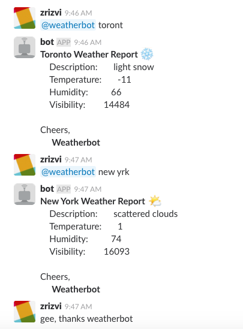

# CPS847-Group-2 Assignment 1


## Weatherbot & Echobot (Question 14 & 19)


### Requirements

* Python3.x

* `pip3 install -r requirements.txt`


The weatherbot slackbot uses the [Open Weather Map API](https://openweathermap.org) to fetch data by city name. This requires an API key, which can then be stored under `.env` alongside
the slackbot api key:


```
# .env
WEATHERBOT_API_KEY="insert the weatherbot api key" //TO CHANGE
ECHOBOT_API_KEY="insert the echobot api key"       //TO CHANGE
OPENWEATHER_API_KEY="the openweather api key"      //TO CHANGE
```

Alternatively, you can export these before use:

```
$ export WEATHERBOT_API_KEY="insert the weatherbot api key" //TO CHANGE
$ export ECHOBOT_API_KEY="insert the echobot api key"              //TO CHANGE
$ export OPENWEATHER_API_KEY="the openweather api key"             //TO CHANGE

```

Or save them as environment variables in your `.bashrc`


```
$ echo "WEATHERBOT_API_KEY='insert the weatherbot api key'"  >> $HOME/.bashrc    //TO CHANGE
$ echo ECHOBOT_API_KEY='insert the echobot api key'" >> $HOME/.bashrc            //TO CHANGE
$ echo OPENWEATHER_API_KEY='insert the openweather api key'"                     //TO CHANGE

```


### Usage


Run the weatherbot: 

```
$ python3 weatherbot.py
```
Run the echobot
```
$ python3 echobot.py
```

NLP Technique for Question 20

In slack, grab the weather for any city with `@weatherbot <city>`. Weatherbot will use `difflib` to look for close matches of the input string with the list of all cities contained in `cities.csv`. If a close match is found, weatherbot grabs the city's weather data and pulls out the key features. 

To make things really cool, weatherbot even maps each high-level weather description to an emoji!!!!

See the example below where a real live slack user with spelling difficulties gets real live weather data frm wetherbt!!!



